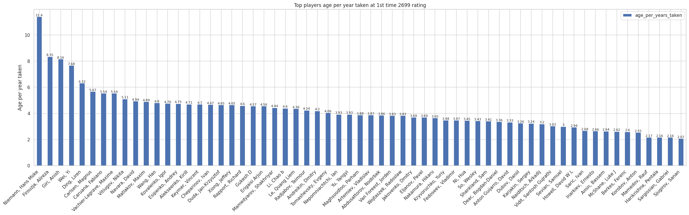
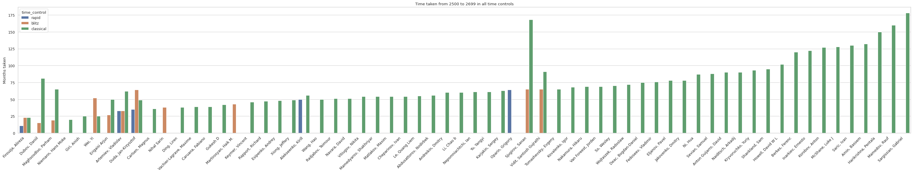
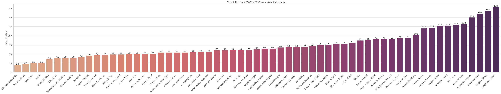
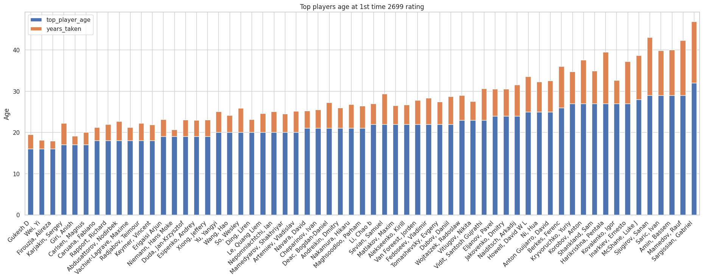
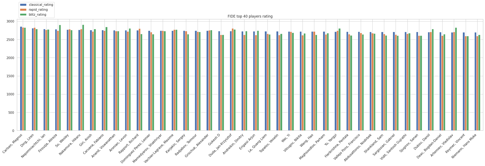
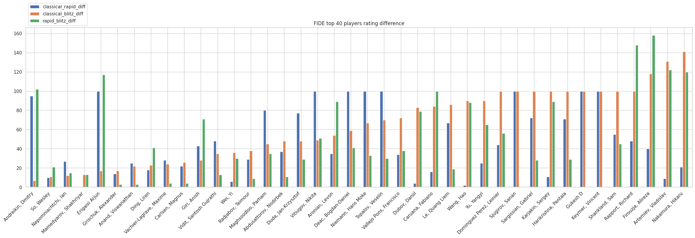
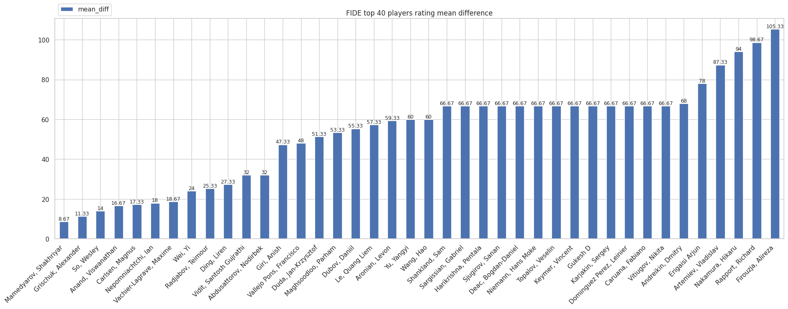

<h1 align="center">
  FIDE Rating Analysis
</h1>

<h4 align="center">The plot speaks for itself</h4>

<p align="center">
  <a href="#about">About</a> •
  <a href="#goal">Goal</a> •
  <a href="#data">Data</a> •
  <a href="#analysis">Analysis</a> •
  <a href="#usage">Usage</a> •
  <a href="#credits">Credits</a> •
  <a href="#license">License</a>
</p>



## About

Jokes aside, with Hans scandal in chess world, a lot of people are curious about this case and this project tries to find some reason for all this scandal.

## Goal

To keep it simple and objective, this project tries to answer the following questions:

- How fast top players grow in different time controls?
    - Does Hans show a strange growth?
- How much close are top players in different time controls?
    - Does Hans show a strange rating variantion among other time controls?

## Data
The JSON data was gathered thanks to this project:
[fide-api](https://github.com/cassiofb-dev/fide-api)

JSON file with FIDE top players info and history:
[data/fide_top_players_2022_10.json](data/fide_top_players_2022_10.json)

CSV file with FIDE top players info:
[src/data/fide_players_info.csv](src/data/fide_players_info.csv)

CSV file with FIDE top players classical rating history:
[src/data/fide_classical_rating.csv](src/data/fide_classical_rating.csv)

CSV file with FIDE top players rapid rating history:
[src/data/fide_rapid_rating.csv](src/data/fide_rapid_rating.csv)

CSV file with FIDE top players blitz rating history:
[src/data/fide_blitz_rating.csv](src/data/fide_blitz_rating.csv)

## Analysis

You can find the minor details on the notebook file:
[src/main.ipynb](src/main.ipynb)

### How fast top players grow in different time controls?

Besides the first players Hans, Firouzja, Giri and Wei Yi all top players (including Carlsen) took more than 30 months to achieve 2699 rating.

### Does Hans show a strange growth?

Yes. Well, the data speak for itself (🤣). Jokes apart, even though he is the first, he is close to Firouzja, Giri and Wei Yi, but when we also look at their date we can obviously see that Hans has a huge value even compared to the cream of the crop.

### How much close are top players in different time controls?

Even though we are dealing with 3 ratings for some kind of lucky a lot of players have the same mean difference of 66.6, but the mean difference is 52.2.

### Does Hans show a strange rating variantion among other time controls?

No. I expected his ratings (mainly classical and blitz) to be far apart because of engine using but that was not the case, it's the most commom rating variation and Firouzja has one of the highest variantions (but the blitz timing is the higher one).

### Some plots
These plots are kinda huge because of there are lot of players so open in another tab and have fun exploring.














## Usage

You will need git and asdf installed, from your terminal:

```sh
git clone https://github.com/cassiofb-dev/fide-rating-analysis

cd fide-rating-analysis

asdf install python 3.10.7

asdf local python 3.10.7

python -m venv venv

source venv/bin/activate

pip install -r requirements.txt

jupyter-lab
```

The last command should open jupyter lab on your browser, open ``src/main.ipynb`` file and run it on jupyter.

## Credits

This project uses git, python (3.10.7) and asdf.

The following python dependecies were used:
```txt
anyio==3.6.1
argon2-cffi==21.3.0
argon2-cffi-bindings==21.2.0
asttokens==2.0.8
attrs==22.1.0
Babel==2.10.3
backcall==0.2.0
beautifulsoup4==4.11.1
bleach==5.0.1
certifi==2022.9.24
cffi==1.15.1
charset-normalizer==2.1.1
contourpy==1.0.5
cycler==0.11.0
debugpy==1.6.3
decorator==5.1.1
defusedxml==0.7.1
entrypoints==0.4
executing==1.1.0
fastjsonschema==2.16.2
fonttools==4.37.4
idna==3.4
ipykernel==6.16.0
ipython==8.5.0
ipython-genutils==0.2.0
jedi==0.18.1
Jinja2==3.1.2
json5==0.9.10
jsonschema==4.16.0
jupyter-core==4.11.1
jupyter-server==1.19.1
jupyter_client==7.3.5
jupyterlab==3.4.8
jupyterlab-pygments==0.2.2
jupyterlab_server==2.15.2
kiwisolver==1.4.4
MarkupSafe==2.1.1
matplotlib==3.6.0
matplotlib-inline==0.1.6
mistune==2.0.4
nbclassic==0.4.4
nbclient==0.7.0
nbconvert==7.2.0
nbformat==5.6.1
nest-asyncio==1.5.6
notebook==6.4.12
notebook-shim==0.1.0
numpy==1.23.3
orjson==3.8.0
packaging==21.3
pandas==1.5.0
pandocfilters==1.5.0
parso==0.8.3
pexpect==4.8.0
pickleshare==0.7.5
Pillow==9.2.0
prometheus-client==0.14.1
prompt-toolkit==3.0.31
psutil==5.9.2
ptyprocess==0.7.0
pure-eval==0.2.2
pycparser==2.21
Pygments==2.13.0
pyparsing==3.0.9
pyrsistent==0.18.1
python-dateutil==2.8.2
pytz==2022.4
pyzmq==24.0.1
requests==2.28.1
seaborn==0.12.0
Send2Trash==1.8.0
six==1.16.0
sniffio==1.3.0
soupsieve==2.3.2.post1
stack-data==0.5.1
tenacity==8.1.0
terminado==0.16.0
tinycss2==1.1.1
tomli==2.0.1
tornado==6.2
traitlets==5.4.0
urllib3==1.26.12
wcwidth==0.2.5
webencodings==0.5.1
websocket-client==1.4.1
```

## License

MIT

---

> [website](https://cassiofernando.netlify.app/) &nbsp;&middot;&nbsp;
> GitHub [@cassiofb-dev](https://github.com/cassiofb-dev) &nbsp;&middot;&nbsp;
> Twitter [@cassiofb_dev](https://twitter.com/cassiofb_dev)
